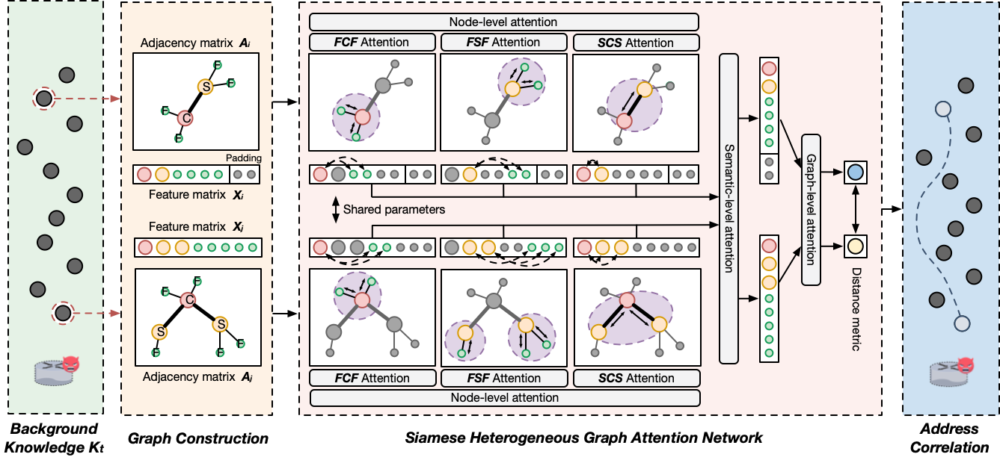

# SiamHAN

**The repository of SiamHAN, an IPv6 address correlation model on TLS encrypted traffic.**

SiamHAN is a method to learn the correlation function from TLS encrypted traffic, which could **determine whether two arbitrary addresses belong to the same user**. First, SiamHAN constructs a knowledge graph for each client address in the historical TLS traffic as background knowledge. Second, SiamHAN employs multi-level attention and metric learning to capture the relationship between two IPv6 addresses.



The work is introduced in the 30th USENIX Security Symposium:

> Tianyu Cui, Gaopeng Gou, Gang Xiong, Zhen Li, Mingxin Cui, Chang Liu. SiamHAN: IPv6 Address Correlation Attacks on TLS Encrypted Traffic via Siamese Heterogeneous Graph Attention Network. USENIX Security Symposium 2021. 4329-4346

See [the conference page](https://www.usenix.org/conference/usenixsecurity21/presentation/cui) for more details about the paper, slides, and the presentation video.

Note: this code is based on [GAT](https://github.com/PetarV-/GAT) and [HAN](https://github.com/Jhy1993/HAN). Many thanks to the authors.

## Requirements

* Python 3
* [TensorFlow](https://www.tensorflow.org/install/) (1.0 or later)
* [scikit-learn](http://scikit-learn.org/stable/)
* [ipaddress](https://docs.python.org/3/library/ipaddress.html#module-ipaddress)

## Data

The real-world IPv6 user dataset is collected from March to July 2018 on China Science and Technology Network (CSTNET). For privacy considerations, we only release part of the anonymous data.

We use the documentation reserved prefix `2001:db8::/32` to anonymize all addresses collected in the traffic according to [RFC 3849](https://www.rfc-editor.org/rfc/rfc3849). Each user is assigned a virtual ID.

If you want to use your own data, please check if the data format is the same as `data/cstnet.json` and specify the data path in `dataloader.py`.

## Training

```shell
python train.py
```

## User Tracking

After obtaining the pre-trained attack model, SiamHAN could be applied to the user tracking task to sustainedly search target IPv6 users under TLS traffic. 

In this setting, a limited number of target users’ one client address activity sample is known. SiamHAN could correlate all addresses of the target users to achieve target user tracking. To do this, please run:

```shell
python inference_tracking.py
```

## User Discovery

User discovery is the second challenging task applied by SiamHAN, which could obtain the address groups to discover unique IPv6 users under TLS traffic. 

In this setting, SiamHAN could calculate the correlation between every two addresses and acquire address clusters to realize user discovery. To do this, please run:

```shell
python inference_discovery.py
```

## Pre-trained Model

Since training on the anonymous dataset will cause performance degradation (especially for the user discovery task), we provide the pre-trained SiamHAN, which could achieve 99% and 87% accuracy on the task of user tracking and user discovery, respectively. To use the pre-trained model, please specify the model path as `pre_trained/siamhan-pretrain.ckpt` and `pre_trained/siamhan-pretrain.ckpt.meta`.

## Cite

We hope that our work demonstrates the serious threat of IPv6 address correlation attacks and calls for effective countermeasures deployed by the IPv6 community. If the code is helpful in your work, please cite our paper:

```
@inproceedings{cui2021siamhan,
  title={SiamHAN: IPv6 Address Correlation Attacks on $\{$TLS$\}$ Encrypted Traffic via Siamese Heterogeneous Graph Attention Network},
  author={Cui, Tianyu and Gou, Gaopeng and Xiong, Gang and Li, Zhen and Cui, Mingxin and Liu, Chang},
  booktitle={30th $\{$USENIX$\}$ Security Symposium ($\{$USENIX$\}$ Security 21)},
  pages={4329--4346},
  year={2021}
}
```

